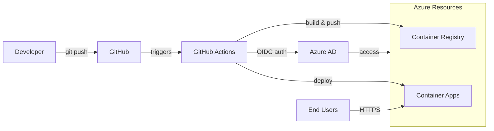
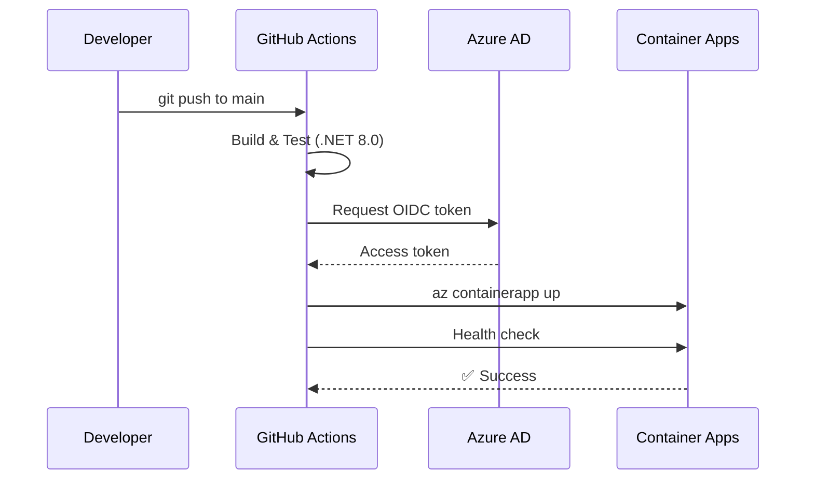
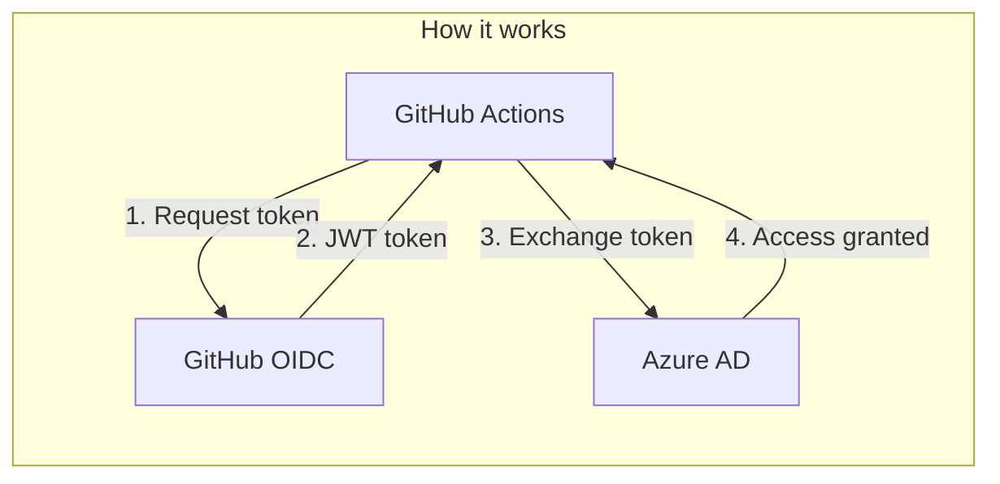
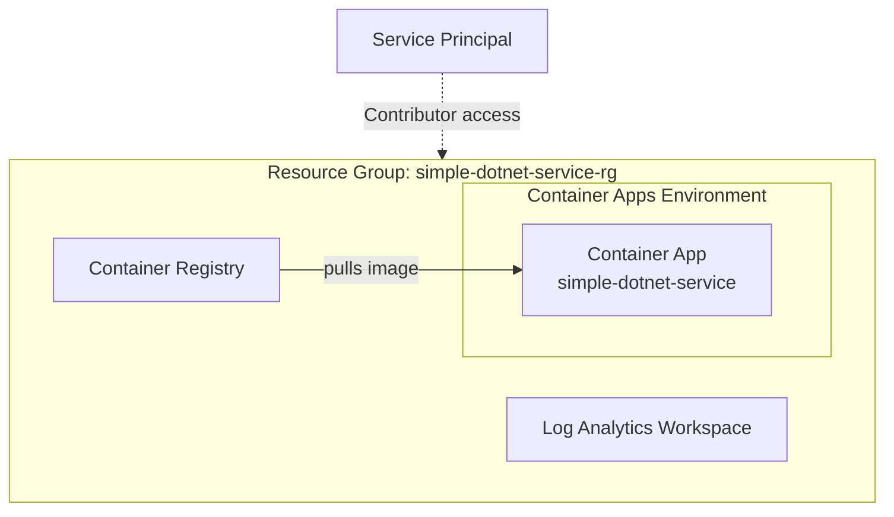
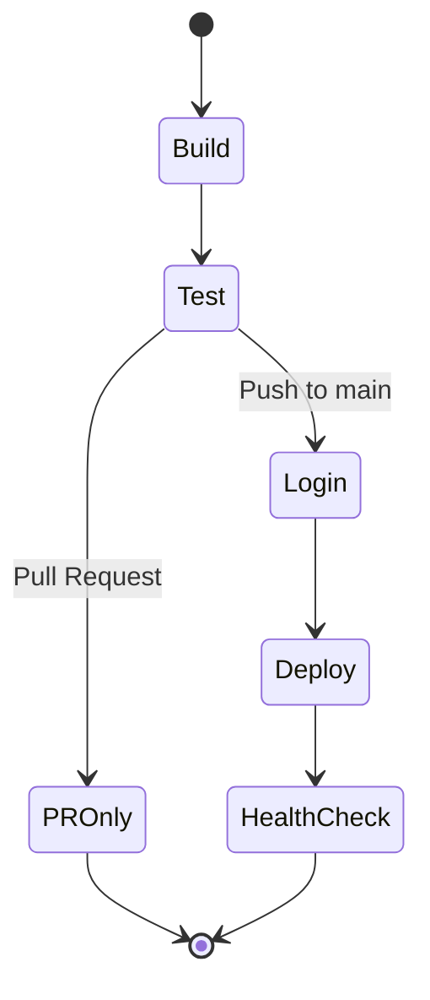

# Deployment Overview

This document explains the CI/CD pipeline from code push to production on Azure Container Apps.

---

## Architecture

---

## Deployment Flow

---

## Workflow Triggers

| Event | Branch | Action |
|-------|--------|--------|
| `push` | `main` | Build + Test + Deploy |
| `pull_request` | `main` | Build + Test only |
| `workflow_dispatch` | any | Manual trigger |

---

## Authentication (OIDC)

GitHub Actions authenticates to Azure using **OIDC** (OpenID Connect) - no stored credentials.

**Benefits over traditional credentials:**
- No secrets stored in GitHub
- Tokens generated per workflow run
- Automatic expiration
- No credential rotation needed

---

## Azure Resources

All resources are created in **Resource Group: `simple-dotnet-service-rg`**

### Resource Group
A logical container that holds all related Azure resources. Enables unified management, access control, and cost tracking for the application.

### Container Apps Environment
A secure boundary for Container Apps that provides:
- **Virtual Network**: Isolated network for container communication
- **Log Analytics integration**: Centralized logging and monitoring
- **Shared configuration**: Common settings across all apps in the environment

### Container App (`simple-dotnet-service`)
The serverless container hosting the .NET 8.0 application:
- **Ingress**: External HTTPS endpoint with automatic TLS certificates
- **Target Port**: 8080 (application listening port)
- **Scaling**: Automatic scale-to-zero when idle, scales up based on HTTP traffic
- **Revisions**: Each deployment creates a new revision for easy rollback

### Container Registry
Private Docker registry that stores application images:
- **Auto-created** by `az containerapp up` command
- **Managed identity access**: Container App pulls images securely without credentials
- **Image tagging**: Each deployment tagged with Git commit SHA

### Log Analytics Workspace
Centralized logging and monitoring:
- **Container logs**: Application stdout/stderr
- **System logs**: Container App platform events
- **Metrics**: CPU, memory, request counts

### Service Principal (`simple-dotnet-gh-actions`)
Azure AD identity for GitHub Actions authentication:
- **Role**: Contributor on the resource group
- **Federated Credential**: Trusts GitHub OIDC tokens from this repository
- **Scope**: Limited to `simple-dotnet-service-rg` only

---

## GitHub Secrets

Three secrets required for OIDC authentication:

| Secret | Description |
|--------|-------------|
| `AZURE_CLIENT_ID` | Service Principal App ID |
| `AZURE_TENANT_ID` | Azure AD Tenant ID |
| `AZURE_SUBSCRIPTION_ID` | Azure Subscription ID |

Add via: **Repository Settings** → **Secrets and variables** → **Actions**

---

## Pipeline Stages

| Stage | Description |
|-------|-------------|
| **Build** | Compile .NET 8.0 application |
| **Test** | Run unit and integration tests |
| **Login** | OIDC authentication to Azure |
| **Deploy** | `az containerapp up` - builds Docker image and deploys |
| **Health Check** | Verify `/api/ip/outbound` responds |

---

**Key Features:**
- ✅ Automated CI/CD on push to main
- ✅ Secure OIDC authentication
- ✅ Containerized deployment
- ✅ Health verification
- ✅ Revision-based rollback
